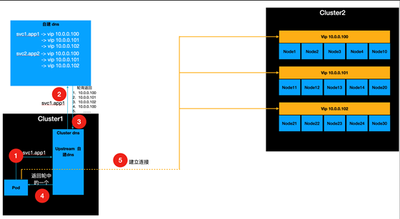
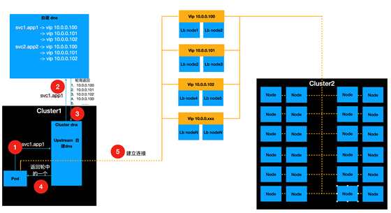

# 简化模式的概述

1. 解析 svc1.app1 域名
2. 通过内部的 coredns 的 forward 选项，将解析请求转发到外部的自建 dns
3. 外部的自建 dns 解析，将结果返回给 Cluster1 的 Pod，然后 Cluster1 Pod 创建 Cluster2 连接
4. Cluster2 连接后，通过 node 之间的 keepalived vip 获取到连接请求并建立连接收发数据

## 优点

简单配置，只需要配置 node 之间的 keepalived

## 缺点

降低性能，一组 keepalived，只会使用一个主机接受请求

## 疑惑点

为什么不直接使用 keepalived 配置 lvs 代理，因为如果使用这种方式进行代理将会出现 tcp 链接池超出的情况，如果使用这种方式，集群中的端口也会超出使用。最好是将 lb 与实际的 worker 节点分开。

负载均衡使用将下游的 worker 节点进行两两分组，然后使用 dns 的 srv 记录实现负载均衡。 

# 横向扩展模式的概述

1. Pod 发送解析 svc.app 域名的请求到 coredns 中
2. 之后自建 dns 将域名解析并返回解析结果到 Cluster1 中，Cluster1 尝试与解析出的 IP 建立连接
3. 建立连接的请求发送到中间的调度器中，调度器调度连接过来的请求到 Cluster2 中实现负载均衡

## 优点

这种方式彻底的将 lb 与 worker 工作节点分离开来，避免出现其他错误

实现了整个集群的 worker 节点运行的负载均衡

如果出现大量并发，例如百万并发，只需要添加负载均衡的调度节点与后端工作的 worker 节点，实现并发即可