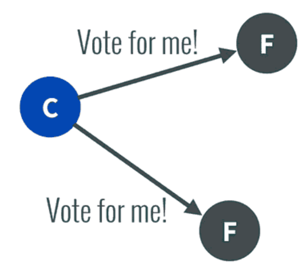
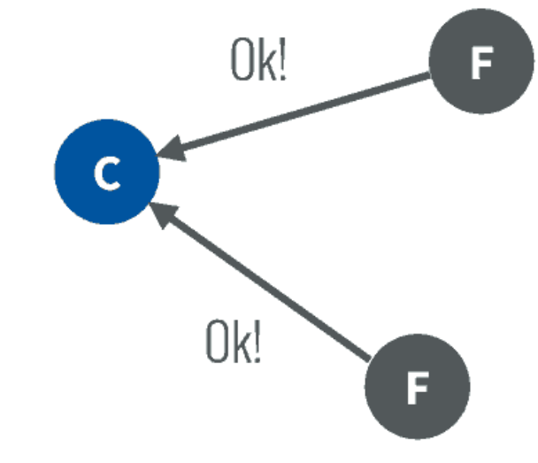
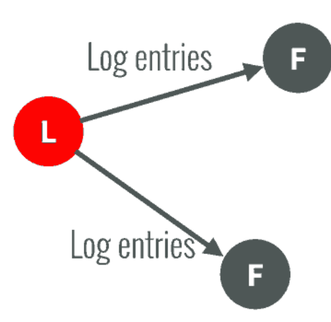
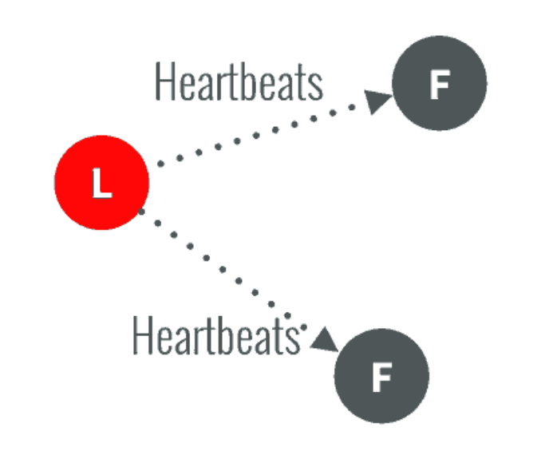
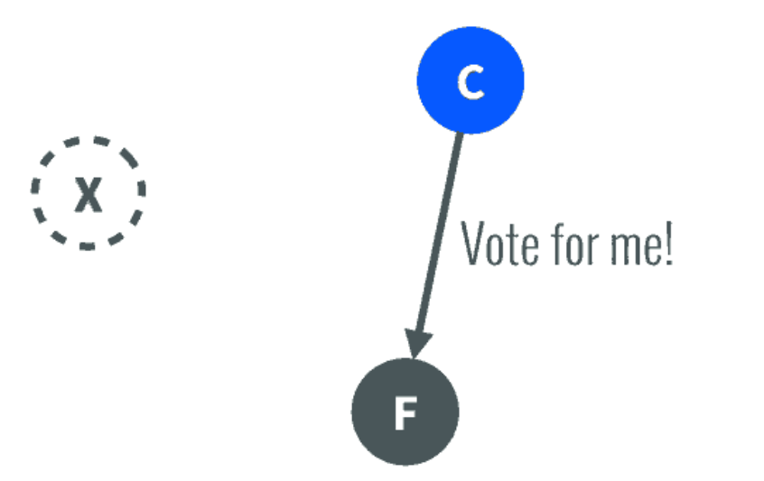
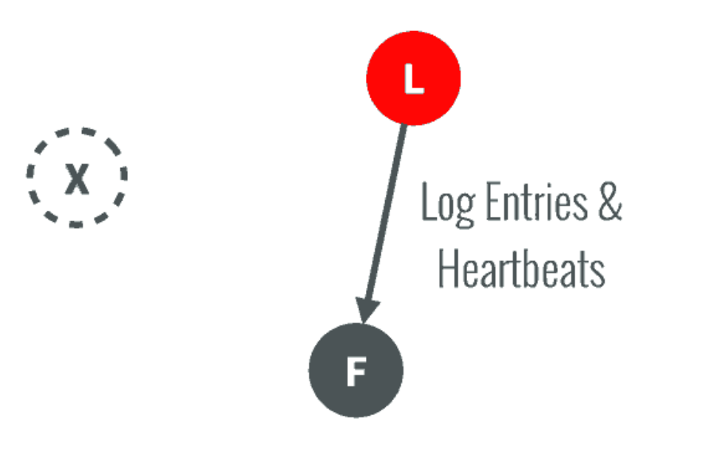
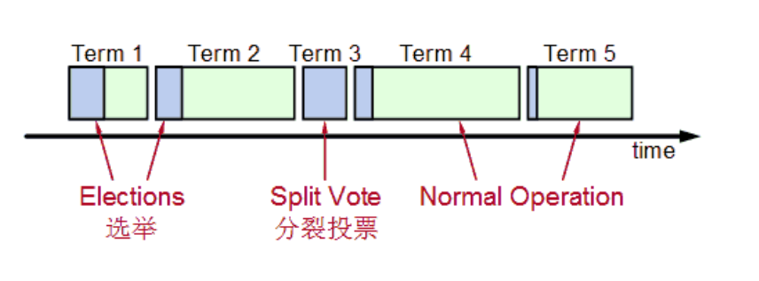

# RAFT算法

etcd 内部使用的强一致算法，之前流行的是 paxos 算法，但是比较难理解，也更加的难以实现。

新研发的 raft 强一致算法，为了确保容错性，即使系统中有一个或多个服务器宕机也不会影响使用，因为其内部的强一致算法，早在存储数据时就将数据同步了。

### Consensus一致性概念

分布式系统中，当出现意外，服务器崩溃或者是变得不可靠，那么就不会跟其他的服务器达到一致性的效果，所以就需要一种 consensus 一致协议来确保容错性以及分布式的稳健性。

### 特点

为了保证优势，不可能会要求所有服务器 100% 都进行同步，只要超过半数的服务器达成一致即可，因为这样即保障了集群的一致性，同步完成后会先向客户端发出存储成功的消息。然后再继续同步到其他的服务器上。

### 集群中角色

Leader 处理所有客户端交互，日志复制等，一般只有一个 leader。

Follower 类似于选民，并且处于完全被动

Candidate 候选人，可以被选为一个新的领导人。

## 分布式选举过程

1. 服务器都可以成为一个候选者，也就是 Candidate，向其他服务器 Follower 发起选举自己的请求

2. 当其他服务器同意了那么就会发出 OK

在这个过程中如果有 Follower 宕机，那么该候选人可以自己选自己。

3. 候选人选举成为了 leader 领导人，那么就可以向选民发送日志复制这样的指令

4. 通过心跳进行日志复制的通知

5. 如果一旦这个 leader 崩溃了，那么follower 就会自动出现一个候选者并且发起要票申请。

6. follower 同意后，就会成为 leader，继续担任日志复制等指导的功能

选举时间是有时间限制的

如果在选举的过程中出现两个候选人同时向 follower 邀票，那么就会通过加赛的形式让候选人重新进行邀票，第二次就会比第一次的比例降低了很多。

## 日志复制

1. leader 接受客户端存储的日志内容
2. 向其他的 follwer 发起更新 commited 的项目，更新或者是追加完成后就会发送 OK 的操作
3. 发出 OK 操作 leader 收到后就会发送到外部信息为 OK

# etcd

### 介绍

是一个分布式键值存储数据库，并且支持分布式平台，其内部应用了 raft 强一致算法。

