# 简介

## 安全容器的诞生

安全容器是一种运行时技术，并且为容器应用提供一个完整的操作系统执行环境。

> 与普通容器相比，最重要的区别是每个容器，都运行在一个单独的微型虚拟机中，并且拥有独立的操作系统内核，以及虚拟化层的安全隔离。因为云容器实例采用的是共享多租集群，因此容器的安全隔离比用户独立拥有私有 kubernetes 集群有更严格的要求。通过安全容器，不同租户之间的容器之间，内核、计算资源、存储和网络都是隔离开的。保护了用户的资源和数据不被其他用户抢占和窃取。

但是应用的执行与宿主机操作系统隔离开，避免应用直接访问主机资源，从而可以在容器主机之间或容器之间提供额外的保护。

## 间接层

安全容器的基础，是 Torvalds 提出的 

“安全问题的唯一正解在于允许那些 Bug 发生，但通过额外的隔离层来挡住。”

因为 linux 系统本身这样的规模已经非常庞大，无法通过语句分析或者是理论上证明程序是没有 Bug 的。所以需要增加额外的隔离层，来减少漏洞或者是这些漏洞造成的被彻底攻破的风险。

## kata-container

安全容器，项目的前身是 runV 以及 intel 的 clear Container 项目。

制作安全容器，只需要一个隔离层，虚拟机本身（是一个现有的隔离层，比如像阿里云和 AWS）只要虚拟机有个内核就可以满足 OCI 的定义，也就是提供了 Linux ABI 的运行环境，在这个环境中跑应用程序并不难。

> Linux ABI 是应用程序的二进制接口，这个接口内提供了可以提供给应用程序调用的各种库文件，提供调用，Windows 与 Linux 是不同的库，所以说应用程序分为 exe 以及执行文件。

**但是唯一的缺陷是虚拟机不够快，阻碍了容器在环境中的应用，如果够快的话，那么就可以使用虚拟机做隔离的安全容器技术，这也是 kata-container 的一个思路。就是用虚拟机做 kubernetes 的 PodSandbox（Pod沙盒）**


通过 kubelet 的 CRI 找到 containerd，containerd 找到 containerd-shim 执行容器命令，容器 cmd/spec 经过 kata-runtime 或者是 kata-shim 发送请求到 kata-proxy 实现对 Pod Sandbox 中的容器执行命令，执行命令时使用的是 Sandbox 中单独的内核空间，并不是使用的宿主机的内核。

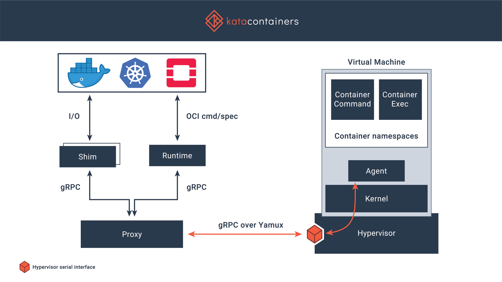

现在云中的容器使用的是通过 vm 虚拟化之后的虚拟机 kernel，而 kata-container 实现的是直接在容器中创建一个 kernel，让容器中的应用程序之后使用都是会调用自身的 kernel。

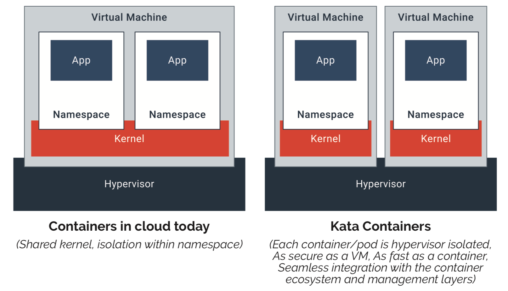

- Runtime：符合 OCI 规范的容器运行时工具。主要用来创建轻量级虚拟机并通过 Agent 控制虚拟机内容器的生命周期。
- Agent：运行在虚拟机中的运行时代理组件，主要用来执行 Runtime 传给它的指令并在虚拟机内管理容器的生命周期。
- Shim：Shim 相当于 Containerd-Shim 的适配，用来处理容器进程的 stdio 和 signals。Shim 可以将 Containerd-Shim 发来的数据流传给 Proxy，Proxy 再将数据流传输给微型虚拟机中的 Agent，Agent 传输给容器并执行相应的动作，同时Shim 也支持将内部 Agent 产生的信号传输给 Proxy，Proxy 再传输给 Shim。
- Proxy：为 Runtime 和 Shim 分配访问 Agent 的控制隧道，路由 Shim 和 Agent 发出的数据流。
- Kernel：是一个单独的内核，提供轻量虚拟机的内核，最小的 4M，根据不同的需要提供几个内核。

> 一个 Pod 的多个容器是被放到同一个微型虚拟机中，也可以根据某些需求，实现共享某些 namespace

## Pod Sandbox


DAX：共享内存，让多个微型虚拟机共享内存中只读的内存空间，节省内存空间。

Virtio-fs：存储共享，共享宿主机中 docker 的 rootfs 目录。

Guest Kernel：仅提供容器的运行时环境，并不提供其他虚拟机给用户的感受，例如登录系统等，纯粹的只是一个内核。

使用 Pod Sandbox 这种方式，使用起来与容器无异，但是实际上在底层看来是一个虚拟机。

## gVisor


进程级别的虚拟化，google 公司为 kata-container 的贡献就是自己内部开发五年并一直在应用的 gVisor 安全容器的解决方案。

不同于 kata 的运行逻辑，在 gVisor 中，是采用 Go 语言重新对内核中的用户空间进行了二次开发，生成 sentry 内核。

sentry 内核，该内核的特点就是可以将攻击者的攻击面减少，也就是会将内核空间中的一些 syscall 调用进行筛选和删减在 sentry 内核中的使用，筛选出一些常用并且较为安全的 syscall 继续提供给用户使用，而一些容易受到攻击且用户并不常用的系统调用将会被删减。

syscall open()，原始 linux kernel 中的 open 系统调用极易受到系统的攻击，因为 linux 中的功能都是依赖于文件实现的，所以通过 open() 调用就会有很多操作。而 sentry 内核将 open() 调用封装到了 Gofer 中，当在容器中调用 open() 调用时会交给 Gofer 进程来执行，执行过程不会允许不良操作。

## 安全容器未来

安全容器创造出的微型虚拟机，在未来的云原生基础架构中会广泛应用，因为其提供的隔离性以及运行的速度相对于传统虚拟化是有过之而无不及的。

在内部集成的 DAX virtio-fs 这种虚拟化组件是非常的节省资源并适用于云原生环境，并且其内部的隔离机制，可以将用户的敏感信息封装到容器的应用中，这样即使运维人员在维护时也不会触及内部的敏感数据，使用的仅仅是外部的 Pod Sandbox 中的内核。

gViosr 虽然目前没有任何优势，但是这种通过在用户空间运行一个 linux 内核并运行应用程序的思路，在之后可能会广泛应用。kata 目前的技术已经成熟并且相对比较好理解。

# 安全容器的设计部分

因为安全容器是在物理机和容器间新增了一个隔离层，所以不可以 k8s 的组件设置为 kata 否则将不能共享主机的资源以及内核参数。

## 需要解决问题

### 容器逃逸

黑客进入到容器，通过容器中共享宿主机内核的内核漏洞提权到宿主机。

### 故障影响

kernel-pannic 因为底层共享的是同一个内核，所以当共享内核时共享的 syscall 系统调用，可能会出现内核 Bug，如果在一台机器上出现了内核 Bug 则该主机上的所有 Pod 将会停止运行。

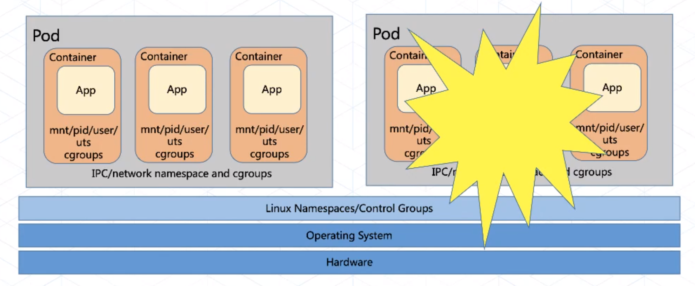

### 资源竞争：性能抖动源泉

在 Linux 中会出现服务运行速度时快时慢，这是因为在 Linux 中不同的服务之间对共享资源发生了争夺。

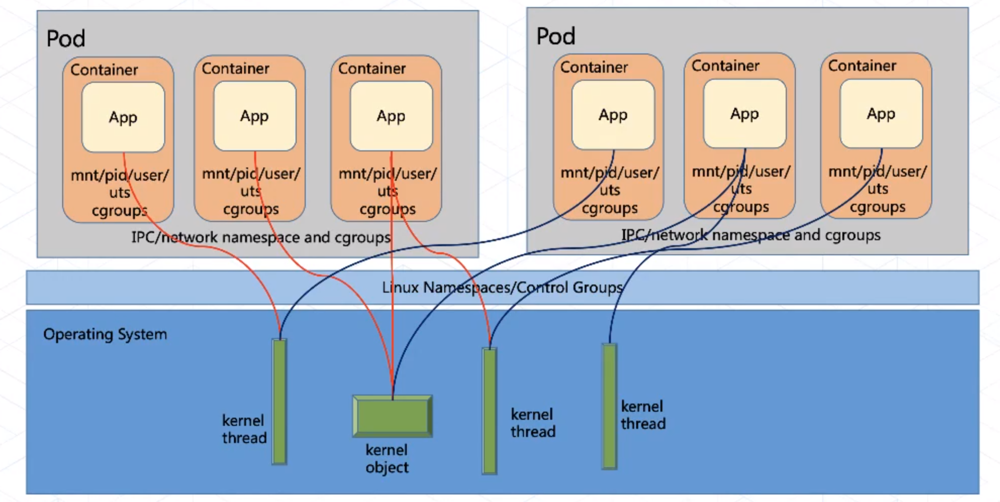

## 解决方法

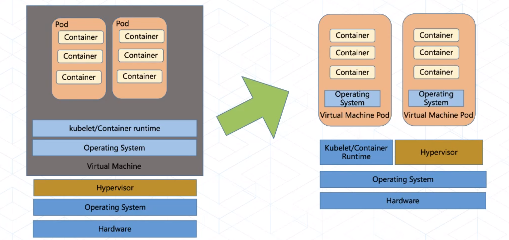

增加一个虚拟层，当然可以直接部署到宿主机的虚拟机中，但是这种方式会极大的放慢主机的性能，因为现在使用的虚拟机技术，例如 vsphere kvm 等虚拟化方式都是基于宿主机之上重构一个完整的虚拟化的主机，及其庞大，并不适用于轻量简洁运行的云原生生态，但是 kata 中集成了专为云原生研发的虚拟化使用的定制内核。

**即使用 kata 即可解决上述问题。**

# 安装kata-container

可以在 github 中的[官方下载教程](https://github.com/kata-containers/kata-containers/tree/main/docs/install)下载 kata-container 每个系统有不同的安装方式。

我使用的是 debian 系统，所以就使用 debian 系统进行安装，教程如下：

```bash
$ export DEBIAN_FRONTEND=noninteractive
$ ARCH=$(arch)
$ BRANCH="${BRANCH:-master}"
$ source /etc/os-release
$ [ "$ID" = debian ] && [ -z "$VERSION_ID" ] && echo >&2 "ERROR: Debian unstable not supported.
  You can try stable packages here:
  http://download.opensuse.org/repositories/home:/katacontainers:/releases:/${ARCH}:/${BRANCH}" && exit 1
$ sudo sh -c "echo 'deb http://download.opensuse.org/repositories/home:/katacontainers:/releases:/${ARCH}:/${BRANCH}/Debian_${VERSION_ID}/ /' > /etc/apt/sources.list.d/kata-containers.list"
$ curl -sL  http://download.opensuse.org/repositories/home:/katacontainers:/releases:/${ARCH}:/${BRANCH}/Debian_${VERSION_ID}/Release.key | sudo apt-key add -
$ sudo -E apt-get update
$ sudo -E apt-get -y install kata-runtime kata-proxy kata-shim
```

如果出现 `gpg: no valid OpenPGP data found.` 的错误，那么可以在浏览器打开 apt 密钥的网页，复制到虚拟机中，之后通过 `apt-key add [filename]` 添加密钥。

安装过程中出现 404 可能是新版本的源并没有更新，修改镜像源即可。

## 更换内核版本

```bash
./build-kernel.sh -v 4.19.86 -b -g nvidia -f -d setup

-v 4.19.86：指定来宾内核版本。
-b：在来宾内核中启用BPF相关功能。
-g nvidia：构建支持Nvidia GPU的来宾内核。
-f注意：即使内核目录已经存在，也会强制生成.config文件。
-d：启用bash调试模式。
```

```bash
go get -d -u github.com/kata-containers/packaging
```

编译内核，在编译时会提示出现 `make oldconfig` 字样，需要先生成 `.config` 文件之后才可以编译。

`.config` 文件中的内容生成的是对 linux 内核的定制。

```bash
./build-kernel.sh build
```

安装内核，安装完成后会自动修改 `/usr/share/kata-containers/defaults/configuration.toml` 路径下文件中指定的内核路径。

```bash
./build-kernel.sh install
```

# 结合Docker

kata-container 运行时检查，检查通过后即可。

```bash
kata-runtime kata-check
```

执行下条命令将 docker 在 unit 文件中的选项插入到 `/etc/default/docker` 文件中。

```bash
sh -c "echo '# specify docker runtime for kata-containers
DOCKER_OPTS=\"-D --add-runtime kata-runtime=/usr/bin/kata-runtime --default-runtime=kata-runtime\"' >> /etc/default/docker"
```

设置 `kata-container` 的配置（下面一步做了这步可以不做）

```bash
cat <<EOF |  tee /etc/systemd/system/docker.service.d/kata-containers.conf
[Service]
ExecStart=
ExecStart=/usr/bin/dockerd -D --add-runtime kata-runtime=/usr/bin/kata-runtime --default-runtime=kata-runtime
EOF
```

设置 `daemon.json` 文件内容（上面一步做了这步可以不做）（建议做此步）

```json
mkdir -p /etc/docker

cat <<EOF | tee /etc/docker/daemon.json
{
  "default-runtime": "kata-runtime",
  "runtimes": {
    "kata-runtime": {
      "path": "/usr/bin/kata-runtime"
    }
  }
}
EOF
```

重启docker

```bash
systemctl daemon-reload

systemctl restart docker
```

运行容器并验证其内部的工作内核，并不是与主机是相同内核，而是通过kata-container虚拟出的一个内核

```bash
root@client:~# docker run -it busybox uname -r
5.4.60-52.container
root@client:~# uname -r
5.4.0-47-generic
```

> 一般容器运行
>
> ```bash
> root@k8s-master1:~# docker run -it busybox uname -r
> 4.19.0-13-amd64
> root@k8s-master1:~# uname -r
> 4.19.0-13-amd64
> ```

在进程中的体现，其中运行了 kata-proxy 用力啊实现堆吼端的代理，其指定监听了指定的 docker 容器 socket。


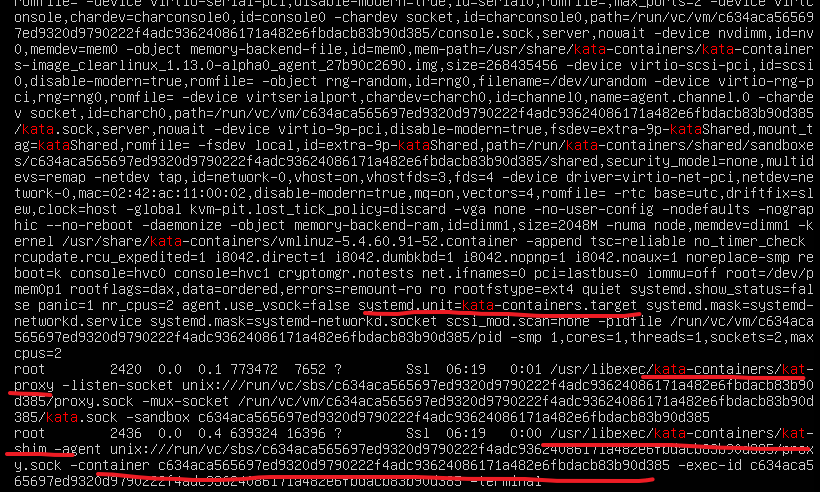

运行的 kata-shim 通过 docker socket 在容器中建立了 agent，并且 kata-shim 指定的容器 ID 与使用 docker 命令查询出的 docker ID 相同。

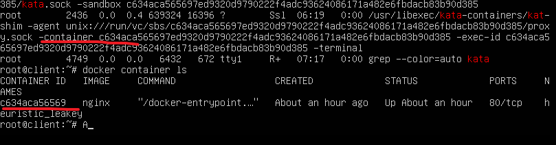

每次创建容器都会创建一组 kata-proxy 以及 kata-agent。

### 安装遇到的问题

**检查不通过**

开启虚拟机的嵌套虚拟化

挂载模块

```bash
tee /etc/modprobe.d/blacklist-vmware.conf << EOF
blacklist vmw_vsock_virtio_transport_common
blacklist vmw_vsock_vmci_transport
EOF

reboot
```

# cri-o + kata-container + kubeadm

## 安装CRI-O

**使用 cri-o 方式安装的 kata-container + kubernetes 最终失败，因为其中 cri-o 中指定的 pasue 镜像一直是拉取不下来，就算修改了 cri-o conf 文件也无济于事，还是会找到默认国外的源，解决这种方式可以通过连接到国外 vpn 的方式实现安装。**

根据 CRI-O 官方安装 CRI-O [CRI-O官方安装教程](https://github.com/cri-o/cri-o/blob/master/install.md#apt-based-operating-systems)。

ubuntu安装方式，其中需要定义 OS 变量。

| Operating system | $OS               |
| ---------------- | ----------------- |
| Debian Unstable  | `Debian_Unstable` |
| Debian Testing   | `Debian_Testing`  |
| Raspberry Pi OS  | `Raspbian_10`     |
| Ubuntu 20.04     | `xUbuntu_20.04`   |
| Ubuntu 19.10     | `xUbuntu_19.10`   |
| Ubuntu 19.04     | `xUbuntu_19.04`   |
| Ubuntu 18.04     | `xUbuntu_18.04`   |

```bash
source /etc/os-release
echo "deb https://download.opensuse.org/repositories/devel:/kubic:/libcontainers:/stable/$OS/ /" > /etc/apt/sources.list.d/devel:kubic:libcontainers:stable.list
echo "deb https://download.opensuse.org/repositories/devel:/kubic:/libcontainers:/stable:/cri-o:/$VERSION/$OS/ /" > /etc/apt/sources.list.d/devel:kubic:libcontainers:stable:cri-o:$VERSION.list

curl -L https://download.opensuse.org/repositories/devel:kubic:libcontainers:stable:cri-o:$VERSION/$OS/Release.key | apt-key add -
curl -L https://download.opensuse.org/repositories/devel:/kubic:/libcontainers:/stable/$OS/Release.key | apt-key add -

apt-get update
apt-get install cri-o cri-o-runc

`想要使用 runc 添加这个版本即可`
cat > /etc/crio/crio.conf.d/01-crio-runc.conf <<EOF
[crio.runtime.runtimes.runc]
runtime_path = ""
runtime_type = "oci"
runtime_root = "/run/runc"
EOF
```

如果安装密钥出现 `gpg: no valid OpenPGP data found.` 警告，手动打开密钥存在的网页，找到绝对路径即可。

## 配置 crio conf 文件

```bash
#指定 kata-runtime 的管理程序，runtime qemu 以及 fc 全部交由 kata-container 进行管理
cat > 02-crio-kataruntime.conf <<EOF
[crio.runtime.runtimes.kata-runtime]
  runtime_path = "/usr/bin/kata-runtime"
  runtime_type = "oci"

[crio.runtime.runtimes.kata-qemu]
  runtime_path = "/usr/bin/kata-runtime"
  runtime_type = "oci"

[crio.runtime.runtimes.kata-fc]
  runtime_path = "/usr/bin/kata-runtime"
  runtime_type = "oci"
EOF


systemctl restart crio
```

### 配置 crio.conf 文件

```bash
###有则修改，无则添加
#因为 kata 运行的工作负载要使用网络，所以将 cri-o 管理网络名称空间的选项设置为 True
manage_ns_lifecycle = true

runtime = "/usr/bin/runc"
runtime_untrusted_workload = "/usr/bin/kata-runtime"
default_workload_trust = "untrusted"
```

## 安装kubernetes

```bash
cat > /etc/apt/sources.list.d/kubernetes.list <<EOF
#中科大源
deb http://mirrors.ustc.edu.cn/kubernetes/apt kubernetes-xenial main
EOF
```

添加密钥

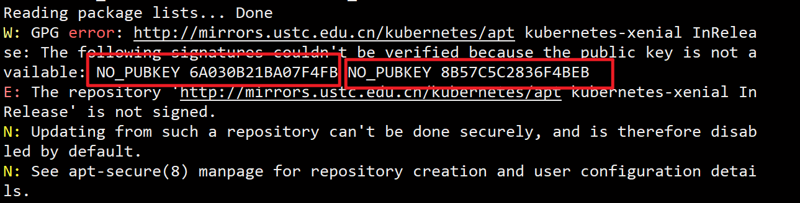

```bash
gpg --keyserver keyserver.ubuntu.com --recv-keys 6A030B21BA07F4FB
gpg --export --armor 6A030B21BA07F4FB | sudo apt-key add -
```

添加密钥后执行 `apt update && apt-get install -y kubelet kubeadm kubectl` 安装 kubernetes 所需组件。

安装完成后进行准备工作：

1. 关闭 swap 交换分区
2. 修改拉取源

## 设置unit文件

```bash
配置 CRI-O
cat > /etc/systemd/system/kubelet.service.d/0-crio.conf <<EOF
[Service]
Environment="KUBELET_EXTRA_ARGS=--container-runtime=remote --runtime-request-timeout=15m --container-runtime-endpoint=unix:///var/run/crio/crio.sock"
EOF

配置容器
cat > /etc/systemd/system/kubelet.service.d/0-cri-containerd.conf <<EOF
[Service]
Environment="KUBELET_EXTRA_ARGS=--container-runtime=remote --runtime-request-timeout=15m --container-runtime-endpoint=unix:///run/containerd/containerd.sock"
EOF
```

**初始化 kubernetes**

```bash
kubeadm init  --cri-socket /var/run/crio/crio.sock --image-repository=registry.aliyuncs.com/google_containers --kubernetes-version=v1.20.5 --pod-network-cidr=10.244.0.0/16   --apiserver-advertise-address=10.0.0.9
```

初始化完成后即可使用。

# containerd + kata-container + kubernetes

这种方式修改了 containerd 拉取镜像源后，即可安装成功。假设现有环境已经安装 kata-container + crictl

## 安装containerd

基于[官方文档](https://containerd.io/downloads/)下载安装即可。

## 配置kubelet

```bash
$ sudo mkdir -p  /etc/systemd/system/kubelet.service.d/ 
$ cat << EOF | sudo tee  /etc/systemd/system/kubelet.service.d/0-containerd.conf 
[Service]
Environment="KUBELET_EXTRA_ARGS=--container-runtime=remote --runtime-request-timeout=15m --container-runtime-endpoint=unix:///run/containerd/containerd.sock" 
EOF 
```

## 配置containerd

### 修改配置文件

```bash
      [plugins."io.containerd.grpc.v1.cri".containerd.untrusted_workload_runtime]
        runtime_type = "io.containerd.runtime.v1.linux"
        runtime_engine = "/usr/bin/kata-runtime"
        runtime_root = ""
        privileged_without_host_devices = false
        base_runtime_spec = ""
```

### 重启 containerd

```bash
[root@master ~]# systemctl restart containerd
```

### 修改 crictl 配置

```bash
[root@master ~]# cat /etc/crictl.yaml
runtime-endpoint: unix:///run/containerd/containerd.sock
image-endpoint: unix:///run/containerd/containerd.sock
timeout: 10
debug: false
```

### 使用kubeadm安装kubernetes集群

```bash
kubeadm init --cri-socket=/run/containerd/containerd.sock --image-repository=registry.aliyuncs.com/google_containers --kubernetes-version=v1.20.5 --pod-network-cidr=10.244.0.0/16   --apiserver-advertise-address=10.0.0.9
```

### 安装完成后测试

创建 Pod 的 yaml 文件

```yaml
apiVersion: v1
kind: Pod
metadata:
  name: busybox01
  # 添加注释，标注使用 kata-container 运行该 Pod
  annotations:
    io.kubernetes.cri.untrusted-workload: "true"
spec:
  containers:
  - name: busybox
    image: busybox:latest
    command: ["/bin/sh","-c","sleep 600"]
```

查看 Pod 使用的运行时

```bash
[root@master ~]# crictl inspect 03bc82ab3d8d7|grep kata
      "runtime": "/usr/bin/kata-runtime"
```

最终效果实现，Pod 中使用的内核与外部不相同，默认情况下，kata-container 会自动尽量的契合系统内核，尽量达到内核号相同。升级宿主机内核后，内核将不会相同。这也就代表安装的 kata-container 已经作为容器底层的运行时。

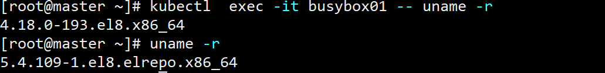

# 基于runtimeclass调度不同运行时容器

可以在不同的 Pod 设置不同的 RuntimeClass，以提供性能与安全性之间的平衡。 例如，如果你的部分工作负载需要高级别的信息安全保证，你可以决定在调度这些 Pod 时尽量使它们在使用硬件虚拟化的容器运行时中运行。 这样，你将从这些不同运行时所提供的额外隔离中获益，代价是一些额外的开销。

你还可以使用 RuntimeClass 运行具有相同容器运行时但具有不同设置的 Pod。

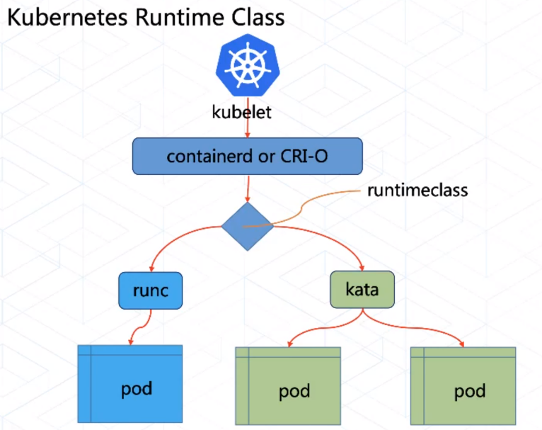

RuntimeClass 的配置依赖于 运行时接口（CRI）的实现。 根据你使用的 CRI 实现，来了解如何配置。配置 CRI 的方式，每种 CRI 都有不同的配置方式。所有这些配置都具有相应的 `handler` 名，并被 RuntimeClass 引用。 handler 必须符合 DNS-1123 命名规范（字母、数字、或 `-`）。

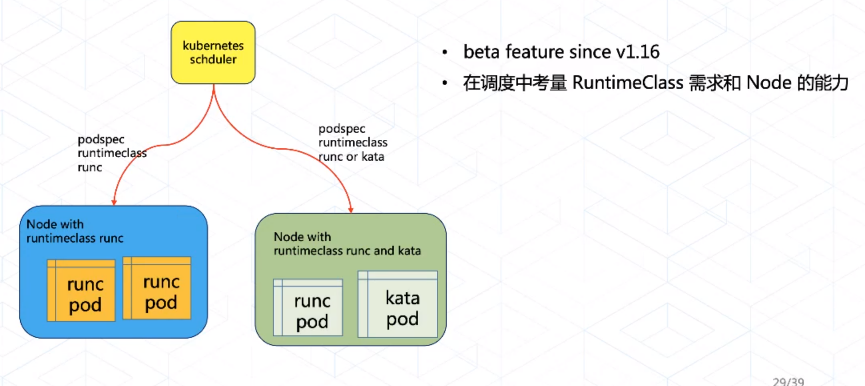

创建 `RuntimeClass` 资源，因为每个配置都有不同的 `handler` 针对每个 handler 需要创建一个 RuntimeClass 对象。

```yaml
apiVersion: node.k8s.io/v1  # RuntimeClass 定义于 node.k8s.io API 组
kind: RuntimeClass
metadata:
  name: myclass  # 用来引用 RuntimeClass 的名字
  # RuntimeClass 是一个集群层面的资源
handler: myconfiguration  # 对应的 CRI 配置的名称
```

Pod 的使用方式。

```yaml
apiVersion: v1
kind: Pod
metadata:
  name: mypod
spec:
  runtimeClassName: myclass
```

这一设置会告诉 kubelet 使用所指的 RuntimeClass 来运行该 pod。 如果所指的 RuntimeClass 不存在或者 CRI 无法运行相应的 handler， 那么 pod 将会进入 `Failed` 终止。 你可以查看相应的事件， 获取出错信息。

如果未指定 `runtimeClassName` ，则将使用默认的 RuntimeHandler，相当于禁用 RuntimeClass 功能特性。

如果这种方式不可以那么可以使用注释方式运行。

### CRI 配置

#### containerd 的配置

通过 containerd 的 `/etc/containerd/config.toml` 配置文件来配置运行时 handler。 handler 需要配置在 runtimes 块中：

```toml
[plugins.cri.containerd.runtimes.${HANDLER_NAME}]
```

#### cri-o 的配置

通过 cri-o 的 `/etc/crio/crio.conf` 配置文件来配置运行时 handler。 handler 需要配置在 crio.runtime 表 下面：

```toml
[crio.runtime.runtimes.${HANDLER_NAME}]
  runtime_path = "${PATH_TO_BINARY}"
```

### 实践

#### containerd 配置

添加以下配置，重启 `containerd`

```toml
      [plugins."io.containerd.grpc.v1.cri".containerd.untrusted_workload_runtime]
        runtime_type = "io.containerd.runtime.v1.linux"
        runtime_engine = "/usr/bin/kata-runtime"
        runtime_root = ""
        privileged_without_host_devices = false
        base_runtime_spec = ""
      [plugins."io.containerd.grpc.v1.cri".containerd.runtimes]
        [plugins."io.containerd.grpc.v1.cri".containerd.runtimes.kata]
          runtime_type = "io.containerd.kata.v2"
          [plugins."io.containerd.grpc.v1.cri".containerd.runtimes.kata.options]
           ConfigPath = "/etc/kata-containers/config.toml"
        [plugins."io.containerd.grpc.v1.cri".containerd.runtimes.katacli]
          runtime_type = "io.containerd.runc.v1"
          [plugins."io.containerd.grpc.v1.cri".containerd.runtimes.katacli.options]

```

#### runtimeClass 创建

```yaml
apiVersion: node.k8s.io/v1  # RuntimeClass 定义于 node.k8s.io API 组
kind: RuntimeClass
metadata:
  name: kata-runtime  # 用来引用 RuntimeClass 的名字
handler: katacli  # 对应的 CRI 配置的名称
```

#### Pod 创建

```yaml
apiVersion: v1
kind: Pod
metadata:
  name: busybox01
spec:
  containers:
  - name: busybox
    image: busybox:latest
    command: ["/bin/sh","-c","sleep 600"]
  runtimeClassName: kata-runtime
```

#### 验证

```bash
name=busybox01 ; crictl inspect `crictl ps -a | grep $(crictl pods | grep $name | awk -F' ' '{print $1}') | awk -F '  '{print $1}'` | grep runtime

    "runtimeType": "io.containerd.runc.v1",
    "runtimeOptions": {
      "binary_name": "/usr/bin/kata-runtime"		# 应用的运行时
    "runtimeSpec": {
```

# 实验内容

1. 使用 `kubectl apply -f` 命令更新 Pod，验证是否可以从普通的容器转换为 `kata-container`

```http
实验结果：不可以进行转换，也不可以从 kata 转换为普通容器
```

2. 验证当主机内核更新后，kata 默认的 sandbox 内核是否会更新

```http
并不会更新，kata 中的 sandbox 内核会一直使用，主机内核不会影响 kata 中的 sandbox 内核版本
```

