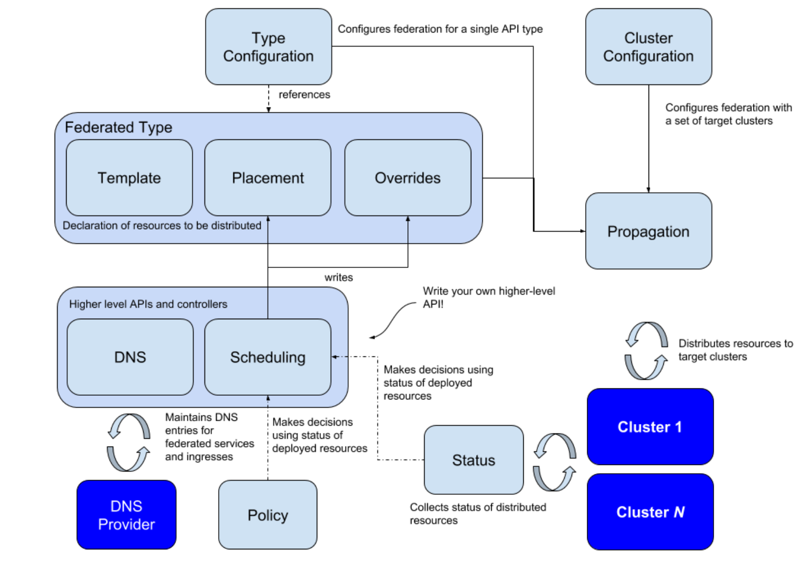

# Kubernetes集群联盟

通过托管集群中的一组 API 协调多个 kubernetes 集群的配置。

- 简化管理多个集群的Kubernetes 组件(如Deployment, Service 等)。
- 在多个集群之间分散工作负载(容器)，以提升应用(服务)的可靠性。
- 跨集群的资源编排，依据编排策略在多个集群进行应用(服务)部署。
- 在不同集群中，能更快速更容易地迁移应用(服务)。
- 跨集群的服务发现，服务可以提供给当地存取，以降低延迟。
- 实践多云(Multi-cloud)或混合云(Hybird Cloud)的部署。

### kubefed v1为什么被废弃

- 控制平面组件会因为发生问题，而影响整体集群效率。
- 无法兼容新的Kubernetes API 资源。
- 无法有效的在多个集群管理权限，如不支持RBAC。
- 联邦层级的设定与策略依赖API 资源的Annotations 内容，这使得弹性不佳。


- federation-apiserver :提供Federation API资源，只支持部分Kubernetes API resources。
- federation-controller-manager :协调不同集群之间的状态，如同步Federated资源与策略，并建立Kubernetes组件至对应集群上。
- etcd :储存Federation的状态。

### kubefed v2版本

实现了模块化和定制化，最大的改变是将 API Server 移除，并且通过 CRD 机制完成 Federated Resource 的扩充。KubeFed Controller 管理这些 CRD，并实现同步 Resources 跨集群编排等功能。

在 Federation 中会分为 Host 和 Member 两种类型的集群。

> - Host :用于提供KubeFed API与控制平面的集群。
> - Member :通过KubeFed API注册的集群，并提供相关身份凭证来让KubeFed Controller能够存取集群。Host集群也可以作为Member被加入。

# KubeFed

是 Kubernetes 集群联盟中孕育而生的技术，可以实现提供一种机制，表达哪些集群应该对其配置进行管理。



- Type Configuration 声明 Kubefed 可以处理那些 API 类型
- Cluster Configuration 声明 Kubefed 将哪些集群设置为 target
- Propagation 指向联合集群分配资源的机制

Type Configuration 有三种策略：

1. Template  定义跨集群的常见资源
2. Placement  定义资源出现在某个集群中
3. Overrides  定义要应用于模板的每个集群的字段级别差异

三种策略提供了在多个集群中的资源简洁声明。

基本概念提供了可被更高级别的 API 使用的构建基块：

- status 收集由 Kubefed 在所有联合集群中分配资源的状态
- Policy 确定允许将资源分配给哪些集群子集
- Scheduler 指是一种决策能力，可以决定工作负载如何在不同集群之间分配

## 使用

### Type Configuration

定义了 Kubernetes 的哪些资源要用于联邦管理，例如是 Configmap 要联邦管理那么就需要在 Host 集群中，使用 CRD 建立新的资源 FederatedConfigMap，接着再建立名称为configmaps 的 Type configuration(FederatedTypeConfig) 资源，然后描述ConfigMap要被FederatedConfigMap所管理，这样KubeFed Controllers才能知道如何建立Federated资源。

范例

```yaml
apiVersion: core.kubefed.k8s.io/v1beta1
kind: FederatedTypeConfig
metadata:
  name: configmaps
  namespace: kube-federation-system
spec:
  federatedType:
    group: types.kubefed.k8s.io
    kind: FederatedConfigMap
    pluralName: federatedconfigmaps
    scope: Namespaced
    version: v1beta1
  propagation: Enabled
  targetType:
    kind: ConfigMap
    pluralName: configmaps
    scope: Namespaced
    version: v1
```


# 安装实现

获取软件

git clone https://github.com/kubernetes-sigs/kubefed.git

启动kind

是运行使用容器“节点”本地Kubernetes集群的工具。这种类型主要是为了测试Kubernetes本身而设计的，但可用于本地开发或CI。

```bash
[root@Host kubefed-master]# kind create cluster
Creating cluster "kind" ...
 ✓ Ensuring node image (kindest/node:v1.19.1) 🖼
 ✓ Preparing nodes 📦
 ✓ Writing configuration 📜
 ✓ Starting control-plane 🕹️
 ✓ Installing CNI 🔌
 ✓ Installing StorageClass 💾
Set kubectl context to "kind-kind"
You can now use your cluster with:

kubectl cluster-info --context kind-kind

Have a nice day! 👋
```

创建集群时指定集群名称，rke 安装

```yaml
nodes:
  - address: 10.0.0.96
    user: docker
    role: [controlplane, worker, etcd]
cluster_name: cluster0
```

安装完成后将多个集群的kubeconfig文件整合成一个

```yaml
apiVersion: v1
clusters:
- cluster:
    certificate-authority-data: ...
    server: https://10.0.0.96:6443
  name: cluster0
- cluster:
    certificate-authority-data: ...
    server: https://10.0.0.97:6443
  name: cluster1
contexts:
- context:
    cluster: cluster0
    user: kube-admin-cluster0
  name: cluster0
- context:
    cluster: cluster1
    user: kube-admin-cluster1
  name: cluster1
current-context: cluster1
kind: Config
preferences: {}
users:
- name: kube-admin-cluster0
  user:
    client-certificate-data: ...
    client-key-data: ...
- name: kube-admin-cluster1
  user:
    client-certificate-data: ...
    client-key-data: ...
```

实现效果为下图

```bash
[root@Host kubefed]# kubectl config get-contexts
CURRENT   NAME       CLUSTER    AUTHINFO              NAMESPACE
          cluster0   cluster0   kube-admin-cluster0
*         cluster1   cluster1   kube-admin-cluster1
```

安装kubefed控制平面，使用helm安装

```bash
kubectl create namespace kube-federation-system
helm repo add kubefed-charts https://raw.githubusercontent.com/kubernetes-sigs/kubefed/master/charts
helm repo list
helm repo update
helm search repo kubefed
helm --namespace kube-federation-system upgrade -i kubefed kubefed-charts/kubefed --version=0.7.0 --create-namespace
kubectl label namespaces kube-federation-system name=kube-federation-system
```

加入集群

```bash
kubefedctl join cluster0 --cluster-context cluster0 \
    --host-cluster-context cluster1 --v=2
kubefedctl join cluster1 --cluster-context cluster1 \
    --host-cluster-context cluster1 --v=2
```

> `--host-cluster-context` 指定的是 host 集群
>
> `--cluster-context` 指定的是要加入的集群
>
> 删除集群使用 `unjoin` 进行删除，`kubefedctl unjoin cluster2 --cluster-context cluster2 --host-cluster-context cluster1 --v=2`

验证加入集群状态

```bash
[root@Host kubefed]# kubectl -n kube-federation-system get kubefedclusters
NAME       AGE    READY
cluster0   100m   True
cluster1   100m   True
```

创建联合名称空间

```bash
kubectl create ns federate-me
```

告诉kubefed联合该名称空间

```bash
./bin/kubefedctl federate ns federate-me
```

创建一个联合的 `Deployment`

```yaml
apiVersion: apps/v1
kind: Deployment
metadata:
  name: test-deployment1
  namespace: federate-me
spec:
  replicas: 3
  selector:
    matchExpressions:
    - key: app
      operator: In
      values:
      - nginx
  template:
    metadata:
      name: nginx
      labels:
        app: nginx
    spec:
      containers:
      - name: nginx
        image: nginx

kubectl apply -f deployment.yaml
```

告诉kubefed联盟`Deployment`

```bash
[root@Host kubefed]# kubefedctl -n federate-me federate deployment test-deployment1
```

验证`FederatedDeployment`已经创建并正确传播

```bash
[root@Host kubefed]# kubectl describe FederatedDeployment -n federate-me
```

> -  Placement :定义Federated资源要分散到哪些集群上，若没有该文件，则不会分散到任何集群中。如FederatedDeployment中的spec.placement定义了两个集群时，这些集群将被同步建立相同的Deployment。另外也支用spec.placement.clusterSelector的方式来选择要放置的集群。
>
> - Override :定义修改指定集群的Federated资源中的spec.template内容。如部署FederatedDeployment到不同公有云上的集群时，就能通过spec.overrides来调整Volume或副本数。

切换集群查看 deployment 是否已经创建，查看 deployment 验证即可

```bash
[root@Host kubefed]# kubectl config use-context cluster0
```

至此实现集群联合。

## 网络方面验证

### 验证方式

1. 在 host 集群中创建 deployment 并开启联合，创建 Service 验证是否可以在 host 访问到 member 集群中的 service

结果为可以，使用 tcpdump 抓包显示会通过 default 名称空间中的主机 IP 转换到内部

2. 验证 host 集群中的联合资源被删除，另一个集群会不会被删除

不会被删除

3. 验证 Service 中的 Endpoints 是否可以整合进多个集群的 target

不会整合进多个集群的 target，只会整合自己的集群


