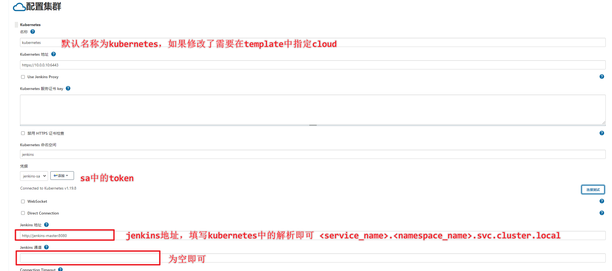
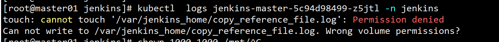
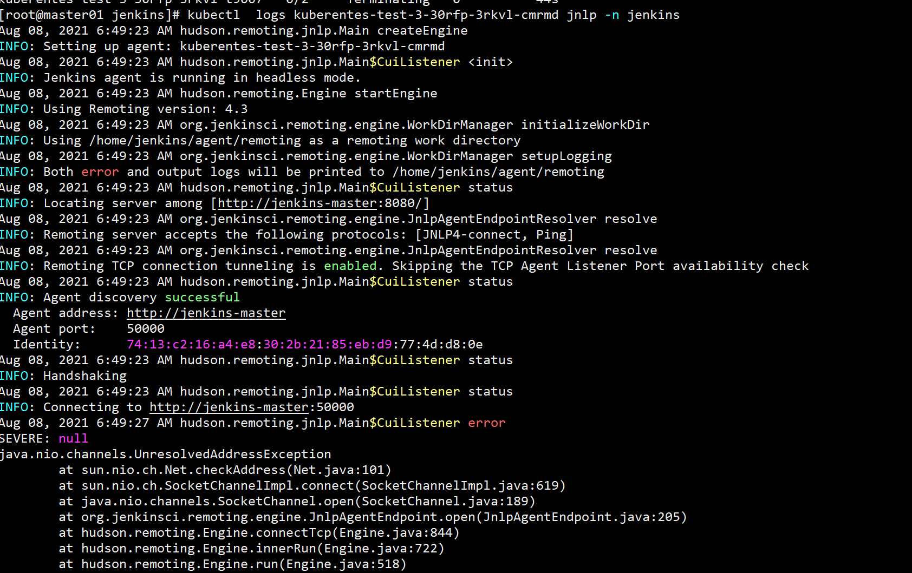

# jenkins安装

安装master slave架构，保证 jenkins 的高可用架构，当在 jenkins master 创建项目时，会自动的创建 jenkins slave 进行编译和构建。

安装构建工具直接使用 `apt-get` 工具进行安装，复制插件复制到 `jenkins/ref` 目录下即可。

如果要安装插件也可以通过定义文件，之后执行安装插件脚本的方式安装插件。

升级方式：直接进行 docker pull 重新 pull 出镜像启动即可，因为所有的信息都保存在 `/home/jenkins` 下。

# 创建步骤

## k8s创建master

```yaml
apiVersion: apps/v1
kind: Deployment
metadata:
  name: jenkins-master
  namespace: jenkins
spec:
  selector:
    matchExpressions:
    - key: podname
      operator: In
      values:
      - jenkins
  replicas: 1
  template:
    metadata:
      name: jenkins-master
      namespace: jenkins
      labels:
        podname: jenkins
    spec:
      containers:
      - name: jenkins-master
        image: jenkins/jenkins:lts-jdk11
        volumeMounts:
        - mountPath: /var/jenkins_home
          name: jenkins-dir
      volumes:
      - name: jenkins-dir
        hostPath:
          path: /mnt/jenkins-dir
          type: Directory
      nodeName: node01
---
apiVersion: v1
kind: Service
metadata:
  name: jenkins-master
  namespace: jenkins
spec:
  type: NodePort
  selector:
    podname: jenkins
  ports:
  - name: jenkins-port
    port: 50000
    targetPort: 50000
    nodePort: 30000
  - name: jenkins-port1
    port: 8080
    targetPort: 8080
    nodePort: 30001
```

## 构建 slave 镜像

```dockerfile
FROM centos:7
MAINTAINER diodonfrost <diodon.frost@diodonfrost.me>

ENV HOME=/home/jenkins
ARG VERSION=3.26

# Install systemd -- See https://hub.docker.com/_/centos/
RUN yum -y swap -- remove fakesystemd -- install systemd systemd-libs
RUN yum -y update; \
(cd /lib/systemd/system/sysinit.target.wants/; for i in *; do [ $i == systemd-tmpfiles-setup.service ] || rm -f $i; done); \
rm -f /lib/systemd/system/multi-user.target.wants/*; \
rm -f /etc/systemd/system/*.wants/*; \
rm -f /lib/systemd/system/local-fs.target.wants/*; \
rm -f /lib/systemd/system/sockets.target.wants/*udev*; \
rm -f /lib/systemd/system/sockets.target.wants/*initctl*; \
rm -f /lib/systemd/system/basic.target.wants/*; \
rm -f /lib/systemd/system/anaconda.target.wants/*;

RUN yum -y install epel-release
RUN yum -y install git sudo openssh-server openssh-clients curl

RUN sed -i -e 's/^\(Defaults\s*requiretty\)/#--- \1/'  /etc/sudoers

# Install Java 8
RUN yum install -y java-1.8.0-openjdk golang && yum clean all

# Add Jenkins user and group
RUN groupadd -g 10000 jenkins \
    && useradd -d $HOME -u 10000 -g jenkins jenkins

# Install jenkins jnlp
RUN curl --create-dirs -sSLo /usr/share/jenkins/slave.jar https://repo.jenkins-ci.org/public/org/jenkins-ci/main/remoting/${VERSION}/remoting-${VERSION}.jar \
    && chmod 755 /usr/share/jenkins \
    && chmod 644 /usr/share/jenkins/slave.jar

COPY jenkins-slave /usr/local/bin/jenkins-slave
RUN chmod 755 /usr/local/bin/jenkins-slave && chown jenkins:jenkins /usr/local/bin/jenkins-slave

RUN mkdir /home/jenkins/.jenkins \
    && mkdir -p /home/jenkins/agent \
    && chown -R jenkins:jenkins /home/jenkins

VOLUME /home/jenkins/.jenkins
VOLUME /home/jenkins/agent

# Systemd volume
VOLUME ["/sys/fs/cgroup"]

WORKDIR /home/jenkins

ENTRYPOINT ["/usr/local/bin/jenkins-slave"]
```


## 配置jenkins的slave

### 参考资料

创建 slave 镜像 dockerfile

```http
https://github.com/diodonfrost/docker-jenkins-slave
```


## 配置kubernetes的jenkins

连接到jenkins上，安装kubernetes plugin，之后配置相应的 Configure Clouds。



使用pipeline构建，可以直接查看 pipeline 语法，根据 podtemplate 创建相应的语法内容

```pipeline
podTemplate(containers: [
    containerTemplate(name: 'golang', image: 'golang:1.8.0', ttyEnabled: true, command: 'cat')
  ]) {		// 创建相应的容器 template
    node(POD_LABEL) {
        stage('Golang project') {	
            container('golang') {	// 指定容器
                stage('Go test') {
                    sh 'go version'
                }
            }
        }

    }
  }
```

jenkins执行过程

1. 自动创建 jnlp 容器，与 jenkins 的 50000 端口进行交互
2. 自动拉取业务镜像并执行命令
3. 执行完成后返回结果并自动删除 job


# 报错信息



出现该报错是因为 jenkins 容器内默认使用的 jenkins 用户 uid 为 1000，将挂载目录权限更改为 1000 即可。

```bash
[root@node01 ~]# chown -R 1000.1000 /mnt/jenkins-dir
```



这个报错是因为配置 Jenkins 页面中将 jenkins 的 tunnel 配置为了 http 协议，实际上 jenkins 在连接时的协议并不是 http 协议，为空即可，Jenkins 会自动根据 Jenkins 的地址找到对应的 tunnel。

## 排错思路

可以直接看日志，结合 jenkins 的两个端口及其日志中和 pipeline 控制台的内容进行排错。