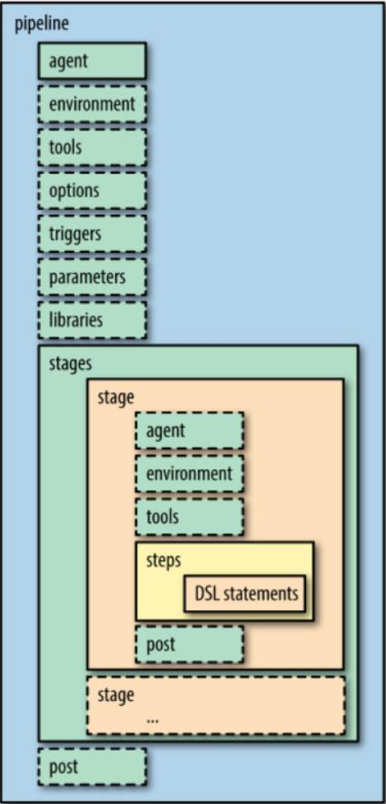
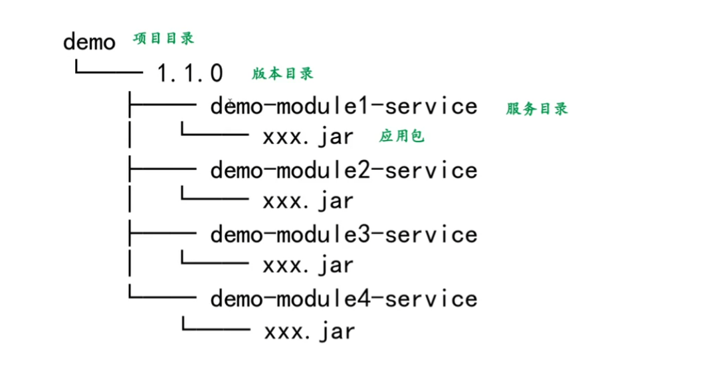
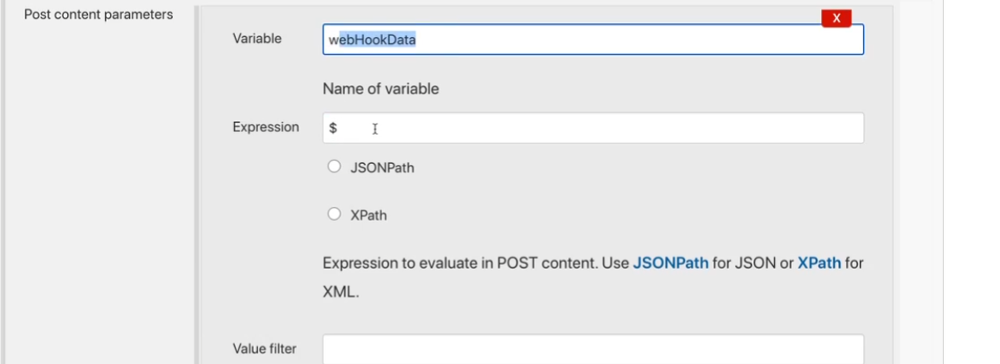

# pipeline 格式



post 是在命令执行完成的最后执行，基于前一个流水线执行的状态判断是否执行

可以在最后发邮件或钉钉时使用

# pipeline 支持同时执行多个

stage内部仅能定义steps、stages、parallel或matrix四者其中之一，且多层嵌套只能用在最后一个stage中；

```pipeline
pipeline {
agent none
stages {
stage('Sequential') {
stages {
stage('In Sequential 1') {
steps {
echo "In Sequential 1"
}
}
stage('In Sequential 2') {
steps {
echo "In Sequential 2"
}
}
stage('Parallel In Sequential') {
parallel {
stage('In Parallel 1') {
steps {
echo "In Parallel 1"
}
}
stage('In Parallel 2') {
steps {
echo "In Parallel 2"
}
}
}
}
}
}
}
}
```


# pipeline中的变量

pipeline中可以直接调用 jenkins 内置的变量进行判断，例如 JOB_NAME 等，在 pipeline 语法生成器中可以看到


# 多分支构建

使用 when 进行判断然后进行构建

# docker镜像编译

一个pipeline中可以使用agent在镜像中执行一系列命令

# pipeline执行触发的方式

upstream 其他工程之后出发

cron 定时构建

gitlab webhook 通过 gitlab 的 webhook 触发

轮询 scm，轮询查看代码库有无改变，改变了那么就触发

# 可以创建是否允许

input 的方式可以在执行流水线时跳出来并询问是否继续，直接通过一下的这种方式，询问是否继续，并且直接赋值到 userinput 中

```pipeline
pipeline {
agent any
stages {
stage('Example') {
steps {
script {
def userInput = input(submitterParameter: "approver", 
id: "approve", message: "Provide your approval to proceed",
parameters: [string(defaultValue: "approved", 
description: 'Please provide the message why your are approving', 
name: 'remarks')])
echo "Remarks: ${userInput['remarks']}"
echo "It was ${userInput.approver} who approved this job"
}
}
}
}
}
```

若要跨stage使用userinput变量，则需要在pipeline代码外部先用def声明变量，而后再于stage中使用该变量；

```text
◼ message， String类型；
◆其内容将打印给用户，并要求用户选择Proceed或Abort；
◆ 若input仅提供了该参数时，还可以省略message参数名称；
◼ id (optional)，String类型；
◆ 每个input都有一个惟一的ID标识，用于生成专用的URL，以便于根据用户输入继续或中止pipeline；
⚫ <JENKINS_URL>/job/[job_name]/[build_id]/input/[input_id]/
⚫ 该URL可通过POST方法进行请求，后跟proceedEmpty表示空输入并继续，而abort则表示中止；
◆ 未定义时，Jenkins将自动为input生成ID；
◼ ok (optional) ，String类型；
◆ 用于自定义Proceed按钮的标签名称；例如，下面的示例中，Proceed按钮的名称为“Yes”
⚫ input message: '<message text>', ok: 'Yes'
◼ parameters (optional)
◆ 要求用户手动输入一个或多个参数列表；
◆ pipeline中，parameters指令支持的参数类型仅是input步骤支持的参数类型的一个子集，因而，那些参数类型都
会被input步骤所支持；
◼ submitter (optional) ，String类型；
◆ 可以进行后续操作的用户的ID或用户组列表，彼此间以逗号分隔，且前后不允许出现空格；
◼ submitterParameter (optional)，String类型；
◆用于保存input步骤的实际操作者的用户名；
```

# 制品库管理

如果没有使用镜像，而是使用的直接部署在虚拟机上，那么可以使用制品库的方式nexus，需要管理规范



# junit工具

能够实现测试报告的图形化，mvn clean package 后在 `[JOB_NAME]/target/surefire-reports/*.xml` 下会生成测试报告。

# 多模块构建


获取webhook所有数据




实际上多模块构建，需要两个scheduler，一个用来调度ci，一个用来调度cd，其中都是通过gitlab中的body响应进行判断。


