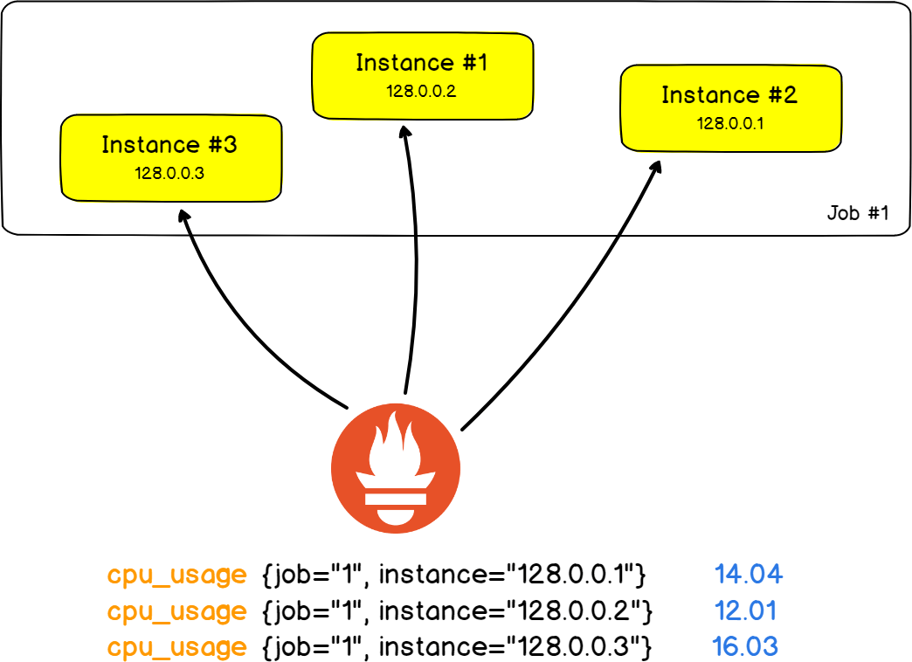
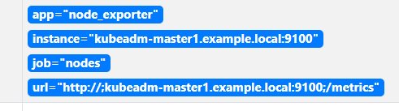

[TOC]

# 概念

## 数据库

Zabbix 使用的数据库 MySQL，这种数据库会产生大量的资源消耗，因为关系型数据库的性能会有瓶颈。

Prometheus 是使用时序数据库存储数据，使用的是 Promql 查询语言，时间序列作为键名存储对应的标签值。时序数据库的组成通常是 `[指标][标签] @时间戳 [标签值]` 来存储标签值。

## 数据采集

**pull：**由服务端从客户端 agent 拉取数据，客户端并不会主动的发送数据。使用 pull 虽然会影响 prometheus 的性能，但是是周期性的。

**push：**客户端直接将指标进行 push，这种方式仅存在于部分的服务之上，并且需要特殊的 pushgateway 抓取这种指标，之后 Prometheus 还是会采用 pull 的方式获取 pushgateway 之上的指标。

## 显示UI

一般 Prometheus 会采用与 Grafana 结合的方式显示相对较为人性化的页面，Prometheus 内部自带的 UI 没有办法持久的保存 PromQL。

## 告警

因为 Prometheus 默认并没有自带对应的告警系统，需要结合 alertmanager 实现对时序数据库指标的判断并告警。

告警介质包括：钉钉、企业微信、短信、邮件。

### 判断状态

软状态，超出阈值几次但是并不会告警，应用于不稳定的服务之上，防止告警频繁。

硬状态，一直处于超出阈值的状态，会联系到指定的动作并告警。

告警的等级，例如可以设置不同级别的告警通知给公司中不同级别的部门领导。

## 白盒与黑盒

### 白盒

应用程序内置的提供指标的服务，可以提供自身的状态，一般应用程序会提供时序指标的 web 服务。

### 黑盒

应用在应用程序并没有提供对应的时许指标的 web 服务，就可以使用 exporter 代理来监控对应的应用程序并提供响应的时序指标 web 服务。

### 网络设备监控

基于 snmp 协议能够实现监控。

# 配置Prometheus

## 配置文件关键字介绍



### Job

让同类型的采集点进行统计，例如 mysql，会将采集的所有 mysql 时序指标上添加 mysql 的 Job 标签。

### Instance

target 是一个采集的端点，端点采集的 IP 地址加上端口就称为 instance。

## 服务发现机制

对于 Prometheus 来说，将 yaml 文件中的 target 列表，转换为自己可以识别的 target 就可以称之为服务发现。

通过 Prometheus.yaml 文件中进行设置，因为 Prometheus 默认是 pull 模型，所以必须要知道 target 的位置才能从相应的 exporter 或者是服务中抓取指标。如果是动态较强的云，手动添加，那么将会产生运维的工作繁琐。Prometheus 特地为此设计了一套动态发现机制，以便于可以基于服务注册中心进行自动发现并检测，而且生成分类为不同的 target，如果节点故障那么就不会一直更新状态，并且会被删除。

三种服务发现的方式：

1. 基于文件的动态服务发现

2. 基于DNS的服务发现

3. 基于API的服务发现

开源服务发现工具：Consul、Eureka Zookeeper Serversct。

### 基于文件的动态服务发现

稍微优于静态配置的服务发现，并且不依赖于任何平台或者是第三方服务。多长时间读取一次取决于 `prometheus.yaml` 文件中配置的 `scrape_interval` 参数。可以将不同的 target 放入到不同的文件，这样可以在生成文件或者是维护时都会很方便，并且可以使用 CMDB 动态的生成 target 文件。

也就是在 Prometheus 运行的过程中，可以修改 target 文件，然后添加节点。

#### target配置文件内容

```yaml
- targets:
  - 10.0.0.98:9100
  - 10.0.0.97:9100
  labels:
   app: node-exporter
```

#### prometheus配置文件内容

```yaml
scrape_configs:
  - job_name: 'node_exporter'
    file_sd_configs:
    - files:
      - target/node-exporter.yaml
      refresh_interval: 1m		#相隔多长时间加载路径中配置的文件，定义为一分钟，默认为 5 分钟
```

### 基于DNS的服务发现

prometheus.yaml配置文件内容

```yaml
scrape_configs:
  - job_name: 'prometheus'
    dns_sd_configs:
    - names: ['prometheus.dingchen.local']        #指定服务发现的 DNS 地址
      type: A        #记录类型
      port: 9100    #端口地址
  - job_name: 'nodes_srv'
    dns_sd_configs:
    - names: ['_prometheus._tcp.dingchen.local']        #SRV 地址记录
```

基于 srv 记录测试并访问

```text
$TTL 1D
@       IN SOA  dingchen.local. rname.invalid. (
                                        0       ; serial
                                        1D      ; refresh
                                        1H      ; retry
                                        1W      ; expire
                                        3H )    ; minimum
        NS      master
master  A       192.168.1.11
node1   A       192.168.1.33
node2   A       192.168.1.30
node3   A       192.168.1.31
prometheus A  192.168.1.35        #指定 A 记录
_prometheus._tcp.dingchen.local. 1H IN SRV 10 10 9100 node1.dingchen.local.
_prometheus._tcp.dingchen.local. 1H IN SRV 10 10 9100 node2.dingchen.local.        #解析为 SRV 记录
_prometheus._tcp.dingchen.local. 1H IN SRV 10 10 9100 node3.dingchen.local.
```

srv 格式介绍

```
_sip._tcp.test.changecan.com. 1H  IN SRV  10 10 5060 see.test.changecan.com.

_sip： 服务（Service）的名字
_tcp ：所使用的协议（Protocol）类型，比如 “_tcp” 或者 “_udp”
test.changecan.com： SRV所在域的名字（Name）
1H： TTL值为1小时
10 ：优先级（Priority），类似MX记录
10 ： 权重（Weight）
5060： 端口（Port）
see.test.changecan.com. ：实际提供服务的主机名（Target ）。
```

### 基于API的服务发现

云厂商提供 api 对接到 prometheus 上即可。

# Prometheus标签管理

## 对 target 重新标记

重新标记期间可以直接使用 __meta__ 对这种标签开头的标签进行重新打标。

如果需要在重新打标期间使用临时标记那么可以使用 __tmp 来开头，以避免同 Prometheus 相冲突。

### 识别每个 target 时 prometheus 显示的标签

1. job 标签是来自配置文件中的 job_name 字段的值
2. __address__的值是来自该 target 的套接字地址主机名加端口或者是 IP 加端口
3. instance标签的值是 __address__的值
4. __scheme__标签的值是改 target 上指标的使用的协议
5. __param_<name>标签的值为传递的URL参数中第一个名称为<name>的参数的值；
6. __metrics_path__标签的值为抓取该target上的指标时使用URI路径，默认为/metrics；

重新标记时，可以直接使用 __meta__开头的元标签

定义在 relabel_config 文件中

### relabel_configs 重新标记操作

##### 可以执行的动作

**创建新标签并赋值**

- replace 替换标签值，首先将

   

  ```
  source_labels
  ```

   

  指定的标签进行串联，然后通过

   

  ```
  regex
  ```

   

  对串联的值进行匹配，匹配到会直接将

   

  ```
  replacement
  ```

   

  中的值赋给

   

  ```
  target_label
  ```

   

  指定的标签

  - 可以将 `regex` 匹配到 `source_labels` 串联的值进行分组，然后进行匹配
  - 如果直接将 `target_label` 指定与 source_labels 相同的标签，那么将会创建一个新的时间序列

- hashmod：将`target_label`的值设置为一个hash值，该hash则由modules字段指定的hash模对块对`source_labels`上各标签的串连值进行hash计算生成

**删除指标**

- keep：regex 不能匹配到 target 上的 `source_labels` 上的标签串联值时，则将该 target 删除（删除的 target 是由 `source_labels` 来定义的）
- drop：regex 能匹配到 target 上的 `source_labels` 的标签串联值时，则将该 target 删除（删除的 target 也是由 `source_labels` 来定义的）

**创建或者是删除标签**

- labelmap：将所有的标签通过 `regex` 进行匹配判定，然后会将匹配的标签值赋值给 `replacement` 指定的指标名之上，通常用来取出原有标签名的数据组织成一个新的指标
- labeldrop：匹配指标中的所有标签名，匹配到的标签名将会被删除，会删除所在 job 的所有此标签名
- labelkeep：匹配指标中的所有标签名，匹配不到的标签名将会被删除，会删除所在 job 的所有不匹配的标签名

```yaml
relabel_configs:
- source_labels:    #引用的标签，可以指多个标签，会将多个标签串联，然后当作一个字符串将值传递给新标签
  - <指标>
  - <指标>
  target_label: <新标签名>        #新标签，并且新标签的值是源标签的值
  regex: <匹配表达式>        #可以对源标签的值做正则表达式模式匹配，然后传递给新标签
  modulus: <Modules>        #直接通过 hash 函数，并且将源标签的值进行 hash 计算，并将结果发送给新标签
  replacement: <数据或者是分组定义 $1>    #定义要赋值给 target_label 标签的值
  separator: <定义连接时的分隔符号>    #指定 replacement 连接时的分隔符号，不指默认就会在变量后添加 ;，一般可以指定为空
  action: <指定动作>        #labelmap labelkeep labeldrop replace hashmod keep drop
```

**删除标签值**

```yaml
YAML
relabel_configs:
- regex: "app"        #指定标签名，会删除所在 job 的所有此标签名
  action: "labeldrop"
```

**重置标签数据**

```yaml
relabel_configs:
- source_labels:
  - up
  regex: endpoint
  target_label: endpoint
  replacement: heihei
  action: replace
```

**创建新的标签**

```yaml
relabel_configs:
 - regex: "(app)"
   replacement: "${1}_name"
   action: labelmap
```

```yaml
relabel_configs:
- source_labels:
  - __scheme__
  - __address__
  separator: ""
  regex: "(http|https)(.*)"
  target_label: "url"
  replacement: "${1}://${2}"
  action: replace
```



# metrics管理

metric 标记是抓取指标完成后获得的标签或者是其他信息，如果需要删除也可以直接通过 metirc 匹配然后执行指定的操作。删除步骤如下：

1. 删除指定的指标
2. 删除指定的不需要的标签
3. 添加删除或者是修改标签值或者是标签格式

与 target 打标的步骤几乎相同，但是 metric 要使用并定义在 `metric_relabel_configs` 字段中。

更改标签后会产生新的时间序列，并且删除标签后可能会导致时间序列一致。

### 对匹配到的标签进行删除

```yaml
metric_relabel_configs:
- source_label:
  - __name__
  regex: "go_info.*"
  action: drop
```

### 对匹配的标签进行修改

```yaml
metric_relabel_configs:
- source_labels:
  - node_filesystem_size_bytes
  target_label: "device"
  replacement: "/dev/sdb1"
  action: replace
- source_labels:
  - node_filesystem_size_bytes
  target_label: "mountpoint"
  replacement: "/root/test"
  action: replace
- source_labels:
  - node_filesystem_size_bytes
  target_label: "fstype"
  replacement: "ext4"
  action: replace
```

# 二开exporter

## 指标类型

### Counter

只增不减的累加指标，是一个计数器，表示一种累积型指标，该指标只能单调递增或者在重新启动时重置为 0。

可以用来表示请求数，已完成的任务或者是错误。

### Gauge

可增可减的测量指标，最简单的度量类型，并且只有一个简单的返回值，可增可减。

用来反映当前状态，CPU温度以及内存使用情况。

### Histogram

自带 buckets 区间用于统计分布的直方图。

例如 http 的请求响应时间，可以用看请求响应时间时间段之间的响应次数。

### Summary

作用在客户端的一方，并不会使用服务器的资源。

## Prometheus默认保存的指标

`up{job="<job>", instance="<instance>"}：`如果实例是健康的，即可达，值为1，否则为0；
`scrape_duration_seconds{job="<job>", instance="<instance>"}：`抓取耗时；
`scrape_samples_post_metric_relabeling{job="<job>", instance="<instance>"}：`指标重新标记后剩余的样本数。
`scrape_samples_scraped{job="<job>", instance="<instance>"}：`实例暴露的样本数

## Prometheus/client_golang包介绍

[godoc网址]([prometheus · pkg.go.dev](https://pkg.go.dev/github.com/prometheus/client_golang/prometheus))其中的 Example 范例中介绍基本用法。

`github.com/prometheus/client_golang/prometheus` 存储指标的类型定义

`github.com/prometheus/client_golang/prometheus/promhttp` 提供给 http.Handle 绑定的处理器函数

```go
package main

import (
	"log"
	"net/http"

	"github.com/prometheus/client_golang/prometheus"
	"github.com/prometheus/client_golang/prometheus/promhttp"
)

var (
    // New 出 Gauge 的类型
    // 通过 Opts 定义传入的结构体
	cpuTemp = prometheus.NewGauge(prometheus.GaugeOpts{
		Name: "cpu_temperature_celsius",
		Help: "Current temperature of the CPU.",
	})
	hdFailures = prometheus.NewCounterVec(
		prometheus.CounterOpts{
			Name: "hd_errors_total",
			Help: "Number of hard-disk errors.",
		},
        // 定义指标名称
		[]string{"device"},
	)
)

func init() {
	// 注册对应的结构体到 Prometheus.Handler 中
    prometheus.MustRegister(cpuTemp)
	prometheus.MustRegister(hdFailures)
}

func main() {
    // 设置对应的值
	cpuTemp.Set(65.3)
	hdFailures.With(prometheus.Labels{"device":"/dev/sda"}).Inc()
	
    // Handle 绑定 URL 和处理器函数
	http.Handle("/metrics", promhttp.Handler())
	log.Fatal(http.ListenAndServe(":8080", nil))
}
```
