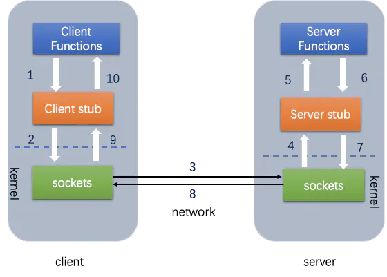
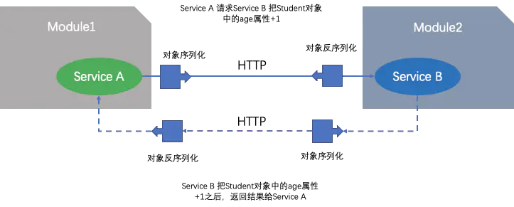

[TOC]

# tars简介

腾讯开源，基于 TARS 协议的高性能 RPC 框架，提供了微服务治理方案。

通过 IDL 接口实现对接多种编程语言。

### 特点

#### 多语言

可以让不同语言的不同平台能够相互交流，打破语言屏障。

#### 敏捷研发

根据接口描述文件，能够自动生成客户端和服务端的相关通信代码，只需要关注业务逻辑如何实现便可以对外提供服务。

#### 快速构建

可以与组件管理，代码扫描，测试等多种工具平台灵活对接，能够让代码质量问题早发现，并且尽早提供解决方案。

#### 高扩展性

剧本微服务体系的高扩展性，在功能扩展时仅需要新增接口。

在性能扩展时可以平行扩容，完全不会影响已经有的服务的运行。

#### 服务发现，容灾容错

业务服务在名称服务中注册，客户端通过服务名字获取实际服务的地址。

当服务的地址因为故障无法上报心跳时，名字服务将不再返回故障节点地址给客户端。Service 原理相同。

客户端也会根据调用被调服务的异常情况自动判断，进行故障屏蔽。

#### 智能调度

tars 支持根据网络以及服务端状态，智能就近调度。

提供 IDC SET 分组等功能，满足更加丰富的个性化调度功能。

#### 过载保护

为了防止因为访问量突增或服务器故障造成系统崩溃，tars 通过非阻塞式的异步请求队列，并且对队列的长度进行监控，从而保障系统的正常运行。

#### 高效运营

##### 无损变更

使部分功能模块在变更过程中通过逐级灰度的方式实现对功能模块的变更。

例如可以使用 deployment 的灰度发布策略，底层就会通过控制 replicaset 实现控制 Pod 灰度发布。

##### 立体化监控

能够实现多维度，立体化的监控。

##### 可视化管理

拥有一套可视化管理平台，让监控更加的直观明了，配置修改更加方便。

多语言，敏捷研发，高可用，高效运营的平台优势，让 tars 成为了互联网开发和运维们得力的助手。

## RPC框架

tars 微服务框架使用的是 tars 协议实现的远程过程调用。

### 微服务 rpc 的实现

通过 http 的 restful 来实现消息的转发

会通过将对象序列化序列化成二进制码，传输给 serverB，然后其 serverB 会对这个二进制码进行反序列化，从而实现传输数据。基于 rest 风格实现。

## kubernetes融合

与 tars 融合到一起，因为名称解析与 kubernetes 是相冲突的，所以融合到一起时就会出现问题。

tars 与 istio 是冲突的存在，是否要使用 istio 不使用 tars？有各自的优缺点。

最好可以结合 kubernetes 实现 tars 的自动调度。

 

### 功能的取舍

|          | 选择 | 原因                                      |
| -------- | ---- | ----------------------------------------- |
| 服务部署 | k8s  | 支持自动调度，业界标准，生态良好          |
| 版本管理 | k8s  | docker 镜像包含基础环境依赖               |
| 名字服务 | tars | 支持关流量，支持 set/idc 分组，客户端容错 |
| 配置管理 | tars | 支持版本管理，应用 set 服务级配置引用     |

## 实现方案

## tars与云原生

tars 完善服务治理能力，提供了高效的开发，高质的运营。

k8s 云原生服务部署能力，能够降低成本，并且避免厂商的绑定。

## tars计思想

是采用微服务的思想对服务进行治理，并且对整个系统的各个模块进行抽线的提取出来，进行分层。

并将各个层之间进行解耦或者是松耦合。

最底层的协议层是将业务网络的通信进行统一，并且是使用 IDL 接口定义语言的方式实现开发能够支持多平台，可扩展，协议代码自动生成统一的协议。开发人员不需要再考虑协议是否可以跨平台使用，是否可能需要兼容，扩展等问题。

中间的三层，设计思路主要是让业务开发更加聚焦业务逻辑的本身，并且内部封装了大量常用的公共调用库以及远程过程调用，RPC 框架使用的是 tars 特有的 tars 协议实现的远程过程调用框架，比之前 kubernetes 中原生的远程调用速度更加快速。

框架本身也实现了高稳定性，高扩展性，高性能等功能。

分布式的角度能够实现，容错，负载均衡，灰度发布等功能框架。

上面的运营层，主要实现的功能主要的设计思路是让运维只需要关注日常的发布，部署，监控，调度管理以及配置等功能。

## 整体架构

### 服务节点

服务节点分为多种，云主机，虚拟机或者是实体机多种，Node 服务节点会对业务服务节点进行统一管理，提供启停，发布，监控等功能，并且会接收业务服务节点上报过来的心跳。

Node 服务节点通过业务服务节点提供的状态信息（心跳）来判断该业务节点的运行状态。

### 公共框架节点

公共框架节点的数量不一，根据实际的服务节点的数量然后基于自身的需求来确定公共框架节点的数量。例如某些服务需要较多的日志，那么就需要多个日志节点实现。

#### web管理系统

可以在 web 上看到服务运行的各种实时的数据情况，以及对服务进行发布，启停，部署等操作，可以直接在 web 服务器上实现。

#### registry路由+管理服务

提供服务节点的地址查询，发布，启停，管理等操作，并且也可以对服务上报心跳的管理，通过它可以实现服务的注册与发现。

#### patch发布管理

提供服务的发布功能

#### config配置中心

提供服务配置文件的统一管理功能

#### log远程日志

提供服务将日志同步到远程的功能

#### stat调用统计

统计业务服务自定义上报的各种调用信息，例如总流量，平均耗时，超时率等，以便对服务出现异常时进行告警。

#### property业务属性

统计业务自定义上报的属性信息，例如内存使用的队列大小，cache命中率等，便于服务出现异常时进行告警。

#### notify异常信息

统计业务上报的异常信息，例如服务状态变更信息，访问 db 失败信息等，以便于服务出现异常时进行告警。

## 服务交互流程

### 服务发布流程

在 web 系统上传 server 的发布包到 patch。上传成功后，在 web 上提交发布 server 请求，由 registry 服务传达到 node，然后 node 拉取 server 的发布包到本地，拉起 server 服务。

#### 应用的技术

path 发布中心

registry 的路由管理服务

node 管理 server 的服务

### 管理命令流程

web 系统提交管理 server 服务命令请求，然后由 registry 服务传达到 node 服务，然后由 node 向 server 发送管理命令。

#### 应用的技术

registry 对 node 下达命令的操作

node 对 server 服务下达命令的操作

### 心跳上报流程

server 服务运行后，会定期上报心跳到 node，node 会将服务心态哦信息上报到 registry 服务，registry 进行统一管理。

#### 应用的技术

registry 实现了心跳的收集，实现了对服务节点的启停操作。

### 信息上报流程

server 服务运行后会定期上报统计信息到 stat，并且会传输日志到 log，会定期上报自身的属性信息到 property，上传异常信息到 notify，也会从 config 中拉取服务配置信息。

#### 应用的技术

property 统计属性信息，例如队列长短等功能

notify 异常信息的统计，会统计异常信息，然后对异常信息进行统计并进行分析

config 配置中心，当 server 启动后会通过 config 拉取自身的配置，这个配置是通过配置 server 得来的

### client 访问 server 流程

client 能够通过 server 的对象名间接的访问 server，client 也会从 registry 上拉取 server 的路由信息，然后会根据具体的业务特性，访问 server。

1. 可以通过对象名访问 server
2. 可以通过 registry 上拉取的路由信息访问 server。

## web管理系统

业务管理，可以管理已经部署的服务，监控等。

运维管理，包括服务部署，扩容，模板管理等。

## 特性

tars 协议采用接口描述语言 IDL 实现，是一种二进制，可以扩展，并且代码可以自动生成，支持多平台的协议。

可以让在不同平台上运行的对象和用不同语言编写的程序，可以用 RPC 远程调用的方式相互通信交流，主要应用在后台服务之间的网络传输协议。

## 调用方式

### 同步调用

客户端发出调用请求后等待服务返回结果后再继续逻辑；

### 异步调用

客户端发出调用请求后继续其他业务逻辑，服务端返回结果又由回调处理类处理结果；

### 单向调用

客户端发出调用请求后就结束调用，服务端不返回调用结果。

## 负载均衡

服务发现与服务注册，实现的方式就是将内部的 IP 地址解析成一个域名名称，客户端可以直接通过访问名字服务获取到服务的地址信息，Client 再根据需要选择合适的负载均衡方式调用服务。

基础的调度算法，轮询，hash，权重等功能。

### 名字服务排除策略

业务服务会主动的上报心跳给名称服务，让名称服务可以知道服务部署的节点存活情况，如果服务宕机后，那么达到名称服务识别这个服务的阈值后，就会自动删除该服务节点的 IP 地址。

### Client主动屏蔽

如果 Client 调用某个 svr 出现调用连续超时时，或者调用的超时比率超过一定的百分比，那么 Client 就会自动的对这个超时的 svr 进行屏蔽，并且会让流量分发到正常的节点上去。

Client 也会对被屏蔽的节点不定期的重连，如果重连时的状态正常，则会进行正常的流量分发。

## 过载保护

实现了请求队列的监控，通过非阻塞的方式实现了异步系统，这样的方式提高了系统的处理能力，并且对队列的长度进行监控，当超过某个阈值时，就会拒绝新的请求。

超时时间的判断，如果队列处理时间过长，导致队列中有些请求超过了自带超时时间或者是队列超时时间，那么就会直接返回该请求，并且不会再进行处理。

## 消息染色

可以针对不同服务的服务接口进行染色，对于染色的请求，服务会自动把日志上报到特定的染色日志服务器上，使用者只需要在染色服务器上即可分析请求访问的路径。

## IDC分组

减少服务间的访问速度，减少跨地区跨机房带来的网络资源消耗。

客户端发送代码请求到 registry，registry 通过路由调度调用 node，让 node 进行调度这个请求到 svr 中，svr 响应请求并返回数据包到 client 中。

## SET分组

方便对业务服务部署管理进行标准化和容量化，框架提供了 Set 部署能力。set 之间没有调用关系，并且互不干扰，故障隔离，提供运维效率和服务可用性。

## 数据监控

为了更好的反应应用和业务的运行质量情况，能够对该上报的信息进行图形化的显示。

例如内存使用情况，队列大小，以及内存命中率等。

提供了服务状态变更和异常信息上报的功能，方便用户查看服务的发布重启宕机以及错误等功能。

## 集中配置

对业务配置进行集中管理并操作 web 化，可以直接通过 web 进行管理，并且这种配置方式可以更加容易。

set 配置是具体一个 set 分组下所有服务的公共配置，在应用配置的基础上进行补充追加。

节点配置是一个应用节点的个性化配置，它和服务配置合并成为具体一个服务节点的配置。

# tars术语

## APP

标识一组服务的一个小集合，并且应用名必须唯一。通常应用名是对应代码中的某个名字空间。

tars 应用名是框架使用的，业务服务不可以使用。

命名范例：`TestApp`

## Server

服务名，提供服务的进程名称，一个 Server 必须属于某个 app，并且 app 下的 server 名称都具备唯一性。

一个 Server 代表一个独立的程序，并且至少要绑定一个 IP，实现一组相关的接口。

命名范例：`LogServer`

## Servant

服务提供者，提供了一个多个具体的接口，提供给客户端调用。

对应服务代码中一个类，用于继承 tars 协议文件中的 interface，内含多个具体的函数。

一个 Servant 必须要属于某个 Server，并且 Server 下的 Servant 名称都必须唯一。

需要一个名称，提供给客户端使用的，全称是 App.Server.Servant，当客户端调用 Server 时，只需要指定 Servant 的名称即可完成远程通信。

## module

是 tars 协议文件中的关键字，定义了协议的空间，也对应了各语言名字空间。c++ 或者是 java go。
