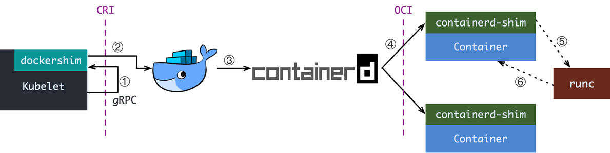
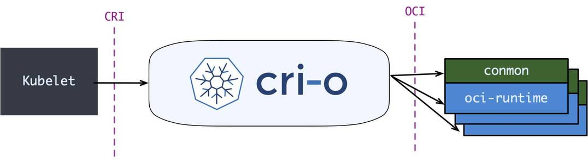
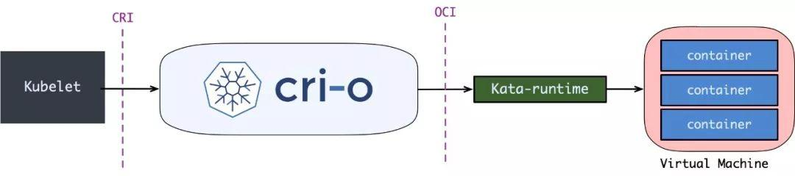

## Kubernetes Runtime架构

1. kubelet 通过 CRI 接口，向 dockershim 发起创建容器的操作，dockershim 实际上就是集成在 kubelet 中，也就是 kubelet 客户端发起创建容器请求到 kubelet。
2. docker shim 接收到请求后就会转化成 docker daemon 能看懂的请求，然后请求 docker daemon 创建容器。
3. docker daemon 自身并不能创建容器，所以就会调用 containerd 来创建容器。
4. containerd 自身并不能创建容器，因为创建容器容器内还需要创建父进程以及回收进程等操作，所以 containerd 创建 containerd-shim 进程，让 containerd-shim 进程创建容器。
5. containerd-shim 创建容器分配的 namespace cgroup 等安全策略参考的就是容器标准（就是创建容器的规范）这个规范的实现就是 runc。
6. runc 被 containerd-shim 调用并启动容器后就会退出。

> runc 的简介，是一个低级工具，并且并非为用户设计，主要由其他更高级别的容器软件应用。例如 docker。

## shim的产生

相当于垫片一样，可以让各种的容器运行时适配到 kubernetes 之上，所以才会产生各种 shim。

docker 当时也不会只开发一种只符合 kubernetes CRI 规范的容器运行时，所以就产生了 docker shim，可以让 kubernetes 调用到 docker 并创建容器。

主要原因是因为 kubernetes 本身在当时没有那么大的影响力。

## CRI-O架构

CRI-O 作为一个只专注于 kubernetes 的容器运行时，剪去了 docker daemon 那种繁琐的调用方式，而是内部集成了 CRI 接口规范以及 OCI 接口规范实现了让 kubelet 直接通过 cri-o 创建 conmon 进程从而创建对应的容器。

## OCI-O与kata-container结合

直接通过 OCI-O 调用 kata-runtime 容器运行时，让 kata-runtime 协商并创建 Pod Sandbox 沙盒，在沙盒中 kata-container 创建了一个虚拟机，然后会将该 kata-runtime 